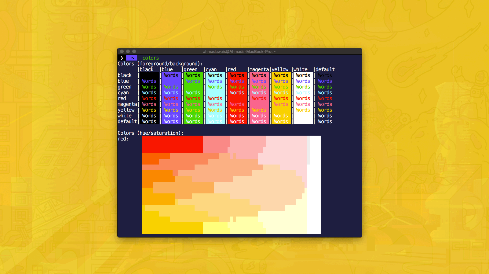

# Shades of Purple Theme for Alacritty

[][course]

  

 

## Install

1. Add the [`alacritty.yml`][theme] file to this path `~/.config/alacritty/alacritty.yml`
2. Restart Alacritty

 

## Put `Shades of Purple` In Other Places

I have built other `Shades of Purple` themes for different software. Here's a list.

- 🦄 [VSCode theme](https://github.com/ahmadawais/shades-of-purple-alacritty) — Shades of Purple
- 🦄 [iTerm2 theme](https://github.com/ahmadawais/shades-of-purple-iterm2) — Shades of Purple
- 🦄 [Hyper™ theme](https://github.com/ahmadawais/shades-of-purple-hyper) — Shades of Purple
- 🦄 [HighlightJS theme](https://github.com/ahmadawais/Shades-of-Purple-HighlightJS) — Shades of Purple
- 🦄 [Konsole theme](https://github.com/ahmadawais/shades-of-purple-konsole) — Shades of Purple
- 🦄 [Slack theme](https://github.com/ahmadawais/shades-of-purple-slack) — Shades of Purple
- 🦄 [Alfred theme](https://github.com/ahmadawais/shades-of-purple-alfred) — Shades of Purple
- 🦄 [Cygwin theme](https://github.com/ahmadawais/Shades-of-Purple-Cygwin) — Shades of Purple
- 🦄 [WordPress theme](https://ahmadawais.com/shades-of-purple-wordpress/) — Shades of Purple
- 🦄 [Prism JS](https://github.com/FormidableLabs/prism-react-renderer/blob/master/src/themes/shadesOfPurple.js) + [Prism CSS](https://codepen.io/ahmadawais/pen/mgjRRr?editors=0100#0) + [Code-Surfer](https://github.com/pomber/code-surfer#themes) theme — Shades of Purple

## SOP's Syntax Colors

Shades of purple theme is built with several shades of purple and a few contrast colors to make things pop. This also makes SOP a very good theme for teaching, presenting, and using on your site via Prisma or HighlightJS. A rough collection of important colors in SOP theme is listed below.

|      USAGE       |                                HEX CODES                                 |
| ---------------- | ------------------------------------------------------------------------ |
| Background       |  `#2D2B55`       |
| Background Dark  |  `#1E1E3F`       |
| Foreground       |  `#A599E9`       |
| Hover Background |  `#4D21FC`       |
| Contrast         |  `#FAD000`       |
| Contrast Lite    |  `#FFEE80`       |
| Contrast Lite II |  `#FAEFA5`       |
| Highlight        |  `#FF7200`       |
| Comment          |  `#B362FF`       |
| Constants        |  `#FF628C`       |
| Keywords         |  `#FF9D00`       |
| Other            |  `#9EFFFF`       |
| Strings          |  `#A5FF90`       |
| Templates        |  `#3AD900`       |
| Definitions      |  `#FB94FF`       |
| Invalid          |  `#EC3A37F5` |
| Diff Added       |  `#00FF009A` |
| Diff Removed     |  `#FF000D81` |

 

## COURSE: Become [VSCode Power User →][course]

After 10 years with Sublime Text, I switched to VSCode — the new open source cross-platform editor everyone's talking about. I've spent over a 1,000 hours perfecting my setup to help you <a href="https://VSCode.pro/?utm_source=sop#module1">switch today</a> and bring all your <a href="https://VSCode.pro/?utm_source=sop#module2">custom settings</a> and the <a href="https://VSCode.pro/?utm_source=sop#module3">power user workflows</a> for <a href="https://VSCode.pro/?utm_source=sop#module4">HTML/CSS</a>, GitHub/<a href="https://VSCode.pro/?utm_source=sop#module5">Git &amp; Open Source</a>, supercharged <a href="https://VSCode.pro/?utm_source=sop#module6">Markdown</a>, and everything from <a href="https://VSCode.pro/?utm_source=sop#module7">JavaScript</a> to <a href="https://VSCode.pro/?utm_source=sop#module8">PHP</a>, Go, Python, C++, C#, ROR &amp; 50+ Extensions. I'm <a href="https://VSCode.pro/?utm_source=sop#module9">sharing it all</a> in five hours — 65 videos online course. <a href="https://VSCode.pro/?utm_source=sop" target="_blank">Learn Visual Studio Code →</a>

  <a href="https://VSCode.pro/?utm_source=sop" target="_blank">🎯 Learn VSCode →</a>

  _<small><a href="https://VSCode.pro/?utm_source=sop" target="_blank">VSCode Power User Course →</a></small>_

 

## License & Attribution

- MIT © [Ahmad Awais](https://twitter.com/MrAhmadAwais/) Creator: Shades of Purple theme.
- Thanks to [Alexander Keliris](https://github.com/Rigellute) for help with creating Alacritty theme.
- [Code of Conduct](code-of-conduct.md)

_👋 Follow Ahmad on Twitter_ 

 
 
 

> After 10 years with Sublime Text, I switched to VSCode — the new open source cross-platform editor everyone's talking about. I've spent over a 1,000 hours perfecting my setup to help you <a href="https://VSCode.pro/?utm_source=sop#module1">switch today</a> and bring all your <a href="https://VSCode.pro/?utm_source=sop#module2">custom settings</a> and the <a href="https://VSCode.pro/?utm_source=sop#module3">power user workflows</a> for <a href="https://VSCode.pro/?utm_source=sop#module4">HTML/CSS</a>, GitHub/<a href="https://VSCode.pro/?utm_source=sop#module5">Git &amp; Open Source</a>, supercharged <a href="https://VSCode.pro/?utm_source=sop#module6">Markdown</a>, and everything from <a href="https://VSCode.pro/?utm_source=sop#module7">JavaScript</a> to <a href="https://VSCode.pro/?utm_source=sop#module8">PHP</a>, Go, Python, C++, C#, ROR &amp; 50+ Extensions. I'm <a href="https://VSCode.pro/?utm_source=sop#module9">sharing it all</a> in five hours — 65 videos online course. <a href="https://VSCode.pro/?utm_source=sop" target="_blank">Learn Visual Studio Code →</a>

 

 
 

  <a href="https://VSCode.pro/?utm_source=sop" target="_blank">
   VSCode</a>

  _<small><a href="https://VSCode.pro/?utm_source=sop" target="_blank">VSCode Power User Course →</a></small>_

 

## Sponsor

Me ([Ahmad Awais](https://twitter.com/mrahmadawais/)) and my incredible wife ([Maedah Batool](https://twitter.com/MaedahBatool/)) are two engineers who fell in love with open source and then with each other. You can read more [about me here](https://ahmadawais.com/about). If you or your company use any of my projects or like what I’m doing then consider backing me. I'm in this for the long run. An open-source developer advocate.

[course]: https://VSCode.pro/?utm_source=sop&utm_campaign=sop&utm_medium=referral
[theme]: https://raw.githubusercontent.com/ahmadawais/shades-of-purple-alacritty/master/alacritty.yml
